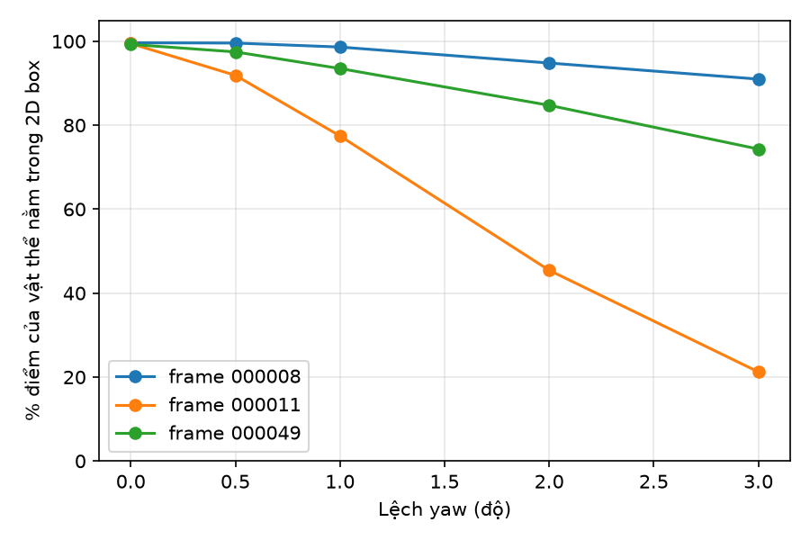
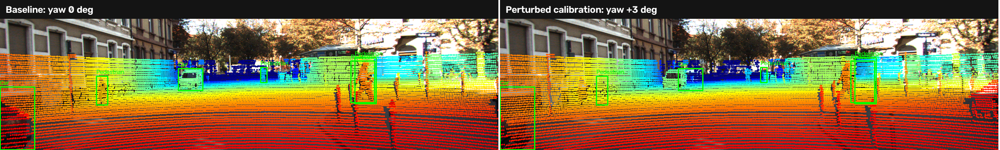

# Báo cáo Day 6: Kiểm tra calibration LiDAR-camera bằng projection

- **Họ tên:** Nguyễn Văn Giáp
- **MSSV:** 2A202602903
- **Lớp:** AI20K-T4
- **Link repo:** https://github.com/Giappp/NguyenVanGiap-2A202602903-Track4-Day21
- **Topic:** A - LiDAR-camera projection QA
- **Dataset:** data/kitti_mini
- **Các frame đã dùng:** 000008, 000011, 000049

## 1. Claim

Trên ba frame KITTI `000008`, `000011`, `000049`, yaw drift tăng từ 0° lên 3° làm tỷ lệ trung bình theo frame của điểm LiDAR thuộc vật thể nằm trong 2D box giảm từ 99.44% xuống 62.18%; frame `000011` giảm còn 21.23%.

## 2. Evidence

| Yaw drift | Điểm vật thể trong 2D box, trung bình 3 frame | Thấp nhất theo frame | Ghi chú |
|---|---|---|---|
| 0° | 99.44% | 99.25% | Baseline |
| 0.5° | 96.30% | 91.88% | Bắt đầu giảm ở frame `000011` |
| 1° | 89.85% | 77.44% | Khác biệt giữa các frame rõ hơn |
| 2° | 75.00% | 45.44% | Frame `000011` giảm mạnh |
| 3° | 62.18% | 21.23% | Frame `000011` là trường hợp nhạy nhất |

Metric là tỷ lệ trong các điểm thuộc 3D box GT và còn được chiếu vào ảnh, có pixel nằm trong 2D box GT. Giá trị trung bình là macro average trên ba frame; CSV lưu từng frame. Số điểm trong ảnh lần lượt khoảng 17.2–20.0 nghìn/frame và thay đổi ít theo sweep.

CSV: `results/yaw_perturb_sweep.csv`; biểu đồ: `results/figures/yaw_sweep.png`.



## 3. Failure case

Ở frame `000011`, yaw drift `+3°` làm tỷ lệ điểm LiDAR thuộc vật thể nằm trong 2D box giảm từ `99.45%` (yaw `0°`) xuống `21.23%`; số điểm vật thể còn trong ảnh giảm từ 725 xuống 537. Điểm trong ảnh tổng thể gần như không đổi (19,946 → 19,948), nên lỗi chủ yếu là điểm trên vật thể bị chiếu lệch khỏi box, không phải mất toàn bộ điểm khỏi FOV. Đây là failure có chủ ý do **Geometry**: extrinsic sai trong khi box nhãn giữ nguyên. Số liệu chi tiết nằm ở `results/yaw_perturb_sweep.csv`.



## 4. Khuyến nghị nếu triển khai thật

Với ADAS, theo dõi tỷ lệ điểm LiDAR trên vật thể nằm trong box camera qua nhiều frame liên tiếp để phát hiện bracket cảm biến bị xê dịch; cảnh báo và yêu cầu kiểm tra calibration khi score giảm bền vững. Cách đo này rẻ, chạy CPU và dễ trực quan hoá, nhưng nhạy với box nhãn, occlusion và loại vật thể. Trước khi đưa vào xe thật, cần hiệu chỉnh ngưỡng trên nhiều tuyến đường, khoảng cách và điều kiện ánh sáng; không tự động cập nhật extrinsic chỉ từ một frame.

## 5. Cách chạy lại

```bash
python -m pip install -r requirements.txt
python -m src.test_projection
python -m src.exp_yaw_sweep --data-root data/kitti_mini --frames 000008 000011 000049
python -m src.plot_yaw_sweep
python -m starter.projection --data-root data/kitti_mini --frame 000011 --out-dir results/figures
python -m starter.projection --data-root data/kitti_mini --frame 000011 --yaw-deg 3 --out-dir results/figures
python -m src.make_failure_comparison
```

Các lệnh chạy từ thư mục gốc repo trong môi trường Python đã cài dependencies. Lệnh sweep tạo CSV; lệnh vẽ tạo biểu đồ và ảnh so sánh failure.

## 6. Khai báo sử dụng AI

| Công cụ | Dùng cho việc gì | Bạn đã kiểm chứng thế nào |
|---|---|---|
| ChatGPT/Codex | Hỗ trợ giải thích phép biến đổi, rà soát projection, xây dựng thí nghiệm và biên tập báo cáo | Đối chiếu công thức với case kiểm tra `(10, 0, 0)` trong `src/test_projection.py`, so sánh metric với CSV 3 frame KITTI và kiểm tra overlay baseline/failure |
